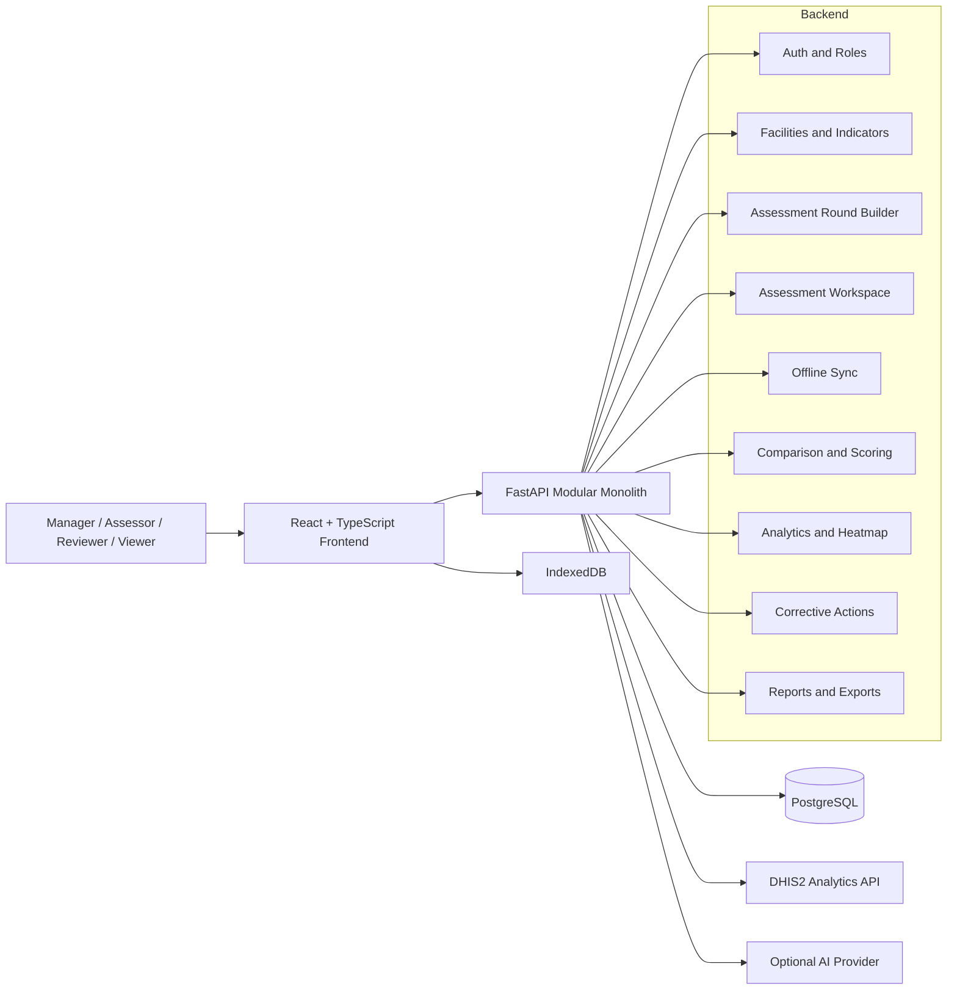

# System Architecture

## Overview

The UCMB HMIS 105 Data Quality Assessment Platform is a lightweight modular monolith designed for a small operational user base. It keeps the deployment shape intentionally simple:

- one FastAPI backend
- one React static frontend
- one PostgreSQL database

It supports planning, field assessment, offline draft capture, comparison, analytics, corrective actions, reporting, and exports without introducing distributed infrastructure.

## Primary Actors

- Manager
- Assessor
- Reviewer
- Viewer

## Technology Summary

### Frontend

- React + TypeScript + Vite
- Tailwind CSS
- role-aware navigation
- IndexedDB for offline package and draft storage
- Recharts for lightweight analytics visuals

### Backend

- FastAPI modular monolith
- SQLAlchemy 2
- Alembic
- Pydantic v2
- httpx for DHIS2 and optional AI provider calls
- python-docx, openpyxl, and ReportLab for exports

### Database

- PostgreSQL only

### External Integrations

- DHIS2 Analytics API
- optional AI provider for report drafting

## Functional Layers

### 1. Access and Governance

- authentication
- role-aware authorization
- audit logging

### 2. Registry and Planning

- facility registry
- live DHIS2 facility search and import
- indicator library
- live DHIS2 data element search and import
- assessment round builder
- Team Lead and Team Member assignment

### 3. Assessment Execution

- online assessor workspace
- DHIS2 field-time pull
- source document checklist
- submission workflow
- offline draft autosave
- manual sync and relogin-aware sync behavior

### 4. DQA Interpretation

- comparison engine
- discrepancy classification
- severity logic
- scoring engine
- analytics and heatmap
- corrective action workflow

### 5. Reporting and Outputs

- structured report data preparation
- AI-safe report drafting
- deterministic template fallback reporting
- review and approval workflow
- DOCX, PDF, and XLSX exports

## End-to-End Flow

1. Manager signs into DHIS2 from Settings after signing into the UCMB platform.
2. Manager tests DHIS2 connectivity from Settings.
3. Manager searches DHIS2 facilities and data elements through FastAPI and imports selected records into PostgreSQL.
4. Manager creates and publishes an assessment round using imported facilities and indicators.
5. Manager assigns a Team Lead and optional Team Members to every selected facility.
6. Team Lead or Team Member opens an assigned workspace.
7. Backend pulls DHIS2 values using the active backend DHIS2 session and stores field-time metadata.
8. Field team captures register and HMIS 105 values.
9. Field team records one general facility assessment comment when contextual notes are needed.
10. If needed, the browser caches the package and local draft for offline continuation.
11. Drafts sync back through an authenticated idempotent sync endpoint.
12. Team Lead, or an explicitly permitted Team Member, sends final assessment data to the manager.
13. Manager or reviewer runs comparison.
14. The system classifies discrepancies, calculates scores, and aggregates analytics.
15. Corrective actions are created, resolved, verified, and closed.
16. Manager or reviewer generates a report draft.
17. Manager reviews, approves, and exports the report.

## DHIS2 Manager Sign-In Flow

DHIS2 credentials are never hard-coded in source code and are never stored in the browser.

1. Manager logs into the UCMB DQA Platform.
2. Manager opens Settings and enters DHIS2 base URL, username, and password.
3. Frontend posts the credentials to FastAPI over the authenticated UCMB session.
4. FastAPI validates the credentials against DHIS2 `/me.json`.
5. If successful, FastAPI keeps the active DHIS2 credential pair in backend process memory.
6. Live DHIS2 search, imports, analytics pulls, and review refreshes use that server-side session.
7. The DHIS2 password is cleared from the frontend form after sign-in.
8. The active DHIS2 session is cleared when a manager signs out of DHIS2 or the backend process restarts.

## DHIS2 Metadata Search and Import Flow

All DHIS2 metadata calls are server-side and require an active manager DHIS2 sign-in:

1. Frontend sends a search term to FastAPI.
2. FastAPI authenticates to DHIS2 using the active manager DHIS2 session and the configured `DHIS2_BASE_URL`.
3. Facility search queries DHIS2 organisation units and normalizes UID, code, name, parent, level, and path.
4. Data element search queries DHIS2 data elements and normalizes UID, HMIS code, value type, aggregation type, category combo, and dataset.
5. Manager imports selected results.
6. Backend upserts by DHIS2 org unit UID or data element UID/operand so repeated imports do not duplicate records.
7. Frontend continues assessment setup from local PostgreSQL records.

DHIS2 credentials are submitted only to the backend, never stored in browser storage, and never returned in API responses.

## Assessment Team Flow

The platform keeps `ASSESSOR` as the broad user role but assigns assessment-level roles per facility:

- `TEAM_LEAD`
- `TEAM_MEMBER`

Team data is stored in `assessment_facility_team_members`. `assigned_assessor_id` remains as a backward-compatible lead reference.

Rules:

- every selected facility requires at least one Team Lead before publishing
- Team Lead and active Team Members can open assigned assessments
- `can_enter_data` controls editing
- `can_submit` controls final submission
- Team Lead defaults to `can_submit=true`

## DHIS2 Auto-Population Flow

1. Workspace request or manager round pre-sync request reaches the FastAPI backend.
2. Backend reads:
   - facility `dhis2_org_unit_uid`
   - assessment round `reporting_period`
   - selected indicator `dhis2_uid_or_operand`
3. Backend requests `analytics.json` from DHIS2.
4. Backend normalizes rows into value and status objects.
5. Backend stores:
   - `dhis2_value_at_assessment`
   - extraction timestamp
   - API status
   - error message when relevant
6. Frontend renders the DHIS2 value as read-only.
7. Manager review refresh stores later values in `dhis2_value_latest` without silently replacing field-time values.

## Offline Draft Flow

1. User authenticates online.
2. User opens an assigned assessment workspace.
3. Frontend caches the workspace package and DHIS2 field-time values in IndexedDB.
4. If connectivity drops, the assessor continues entering only locally editable fields:
   - register value
   - HMIS 105 value
   - assessor comment
   - general facility assessment comment
   - source document checklist
5. Local draft autosave writes to IndexedDB.
6. Pending sync remains visible.
7. When online again, the assessor manually triggers sync.
8. Backend upserts rows idempotently using `client_batch_id`.
9. Submitted-through-sync drafts use the same validation as online submission.

## Comparison and Analytics Flow

1. Comparison engine reads `register_value`, `hmis105_value`, and `dhis2_value_at_assessment`.
2. Null-safe and zero-safe rules calculate differences and severity.
3. High-risk indicators apply stricter logic.
4. Scoring converts comparison output into facility and round scores.
5. Analytics aggregate the stored comparison output into:
   - summary metrics
   - facility rankings
   - indicator summaries
   - source document quality summaries
   - heatmap cells

## AI Reporting Safety Boundary

The AI boundary is intentionally narrow:

- AI reads structured findings only
- AI never changes DQA values
- AI never changes DHIS2
- AI never creates official corrections
- comments are excluded by default
- comments are included only if a manager explicitly requests them
- all generation attempts are logged
- template fallback reporting remains available when no AI key is configured

## Reporting and Export Flow

1. Manager or reviewer selects report type and scope.
2. Backend prepares structured JSON from stored DQA outputs.
3. Backend drafts a report using AI or template fallback.
4. Report is stored with status `GENERATED`.
5. Manager edits if needed.
6. Reviewer or manager marks reviewed.
7. Manager approves.
8. Export endpoints stream DOCX, PDF, or XLSX and write export logs.

## Mermaid Diagram

## Why This Architecture Fits

- The user base is small enough that a monolith is more reliable and easier to operate than distributed services.
- PostgreSQL provides consistency across online assessment, offline sync reconciliation, analytics, and reporting.
- FastAPI keeps the backend strongly typed and easy to extend.
- The frontend stays field-friendly without adding heavy client infrastructure.
- AI reporting and exports are layered on top of structured DQA data without changing the system of record.
